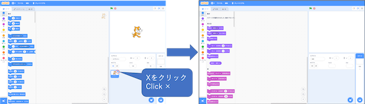
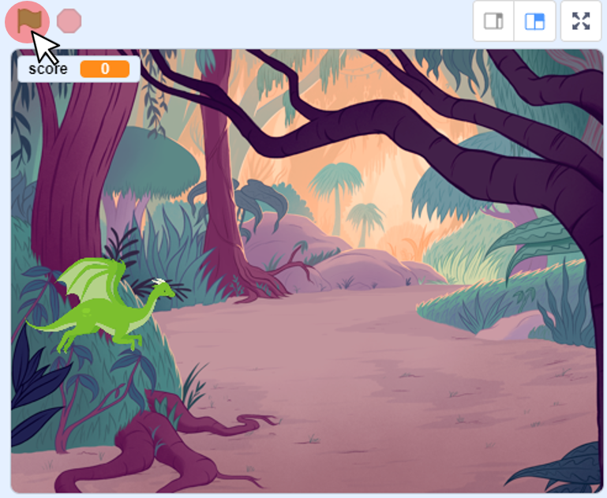
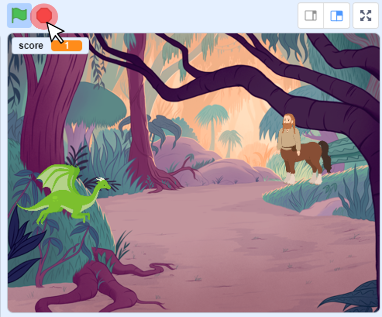

# 1.はじめに(Introduction)

このドキュメントでは、[Scratch 3.0](https://scratch.mit.edu/download)を使ったシューティングゲームの作成方法を説明します。

This document describes how to create shooting game using [Scratch 3.0](https://scratch.mit.edu/download).

ドキュメント作成者：今井　聡(NTTテクノクロス株式会社)

Document Author：Satoshi Imai(NTT TechnoCross Corporation)

# 2.準備:
## 開発環境(Preparation :Development environment)

- [Scratch公式サイト(https://scratch.mit.edu/download)](https://scratch.mit.edu/download)から、Scratch 3.0をダウンロード、インストールする。(Scratch 3.0は、Windows、macOS、chromeOS、Androidに対応。(2020/03/23時点))

    Download and install Scratch 3.0 from the [Scratch official website(https://scratch.mit.edu/download)](https://scratch.mit.edu/download).(Scratch 3.0 is compatible with Windows, macOS, chromeOS, Android. (As of 2020/03/23))

##  プロジェクト作成

- Scratch 3.0を起動し、スプライト1を削除する。(スプライト1を選択→×をクリック)

    Start Scratch 3.0 and delete sprite 1.(Select sprite 1　→　Click ×)

# 3. 作り方(How to develop)

このゲームは、以下の流れで作成します。

This game consists of the following three programs.

1. ドラゴンの作成(make dragon)
2. 敵の作成(ケンタウロス)(make centaur)
3. ステージの作成(make stage)

ここでは、書くプログラムの作り方を説明します。

以下表のプログラム名をクリックすると、プログラムの説明が表示されてます。

プログラムは **『ドラゴンの作成→敵の作成(ケンタウロス)→ステージの作成』の順番で作成** します。

In this section, i will explain how to make each program.

Click on a program name in the table below to see a description of the program.

Develop the program in the order of "make dragon -> make centaur -> make stage".

| プログラム名(Program name) | 概要(Overview) |
|:----|:----|
| [ドラゴンの作成](make_dragon.md) | ドラゴンのプログラムの説明(Dragon's program description) |
| [敵の作成(ケンタウロス)](make_centaur.md) | ケンタウロスのプログラムの説明(Centaur's program description) |
| [ステージの作成](make_stage.md) | ステージのプログラムの説明(Stage's program description) |

# 4.プログラムの保存方法

Scrachのファイルのメニューから『コンピューターに保存する』を選択し、実行してください。

From the Scrach file menu, select "Save to computer" and run it.

# 5. プログラムの実行・停止方法(How to run and stop the program)

## 5-1. プログラムを実行(Run the program)

旗のボタンを押してください。

Press the flag button.

## 5-2. プログラムを停止(Stop the program)

赤いボタンを押してください。

Press the red button.

