# 敵の作り方(ケンタウロス)(How to make enemy #Centaur)

## 前提(Premise)
**[ドラゴンの作り方](make_dragon.md)のプログラムが完成** していること。

    Dragon's program is complete.

## 完成イメージ(Completed image)
- Centaurのスプライト

    Compleate Centaur sprite.

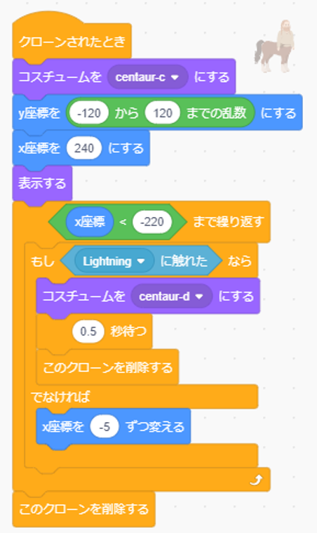

# プログラムの作り方(How to develop a program)
- スプライトを新規に追加する。(スプライト追加ボタン→Centaurをクリック)

    add new sprite.(Click add splite button → Click Centaur)

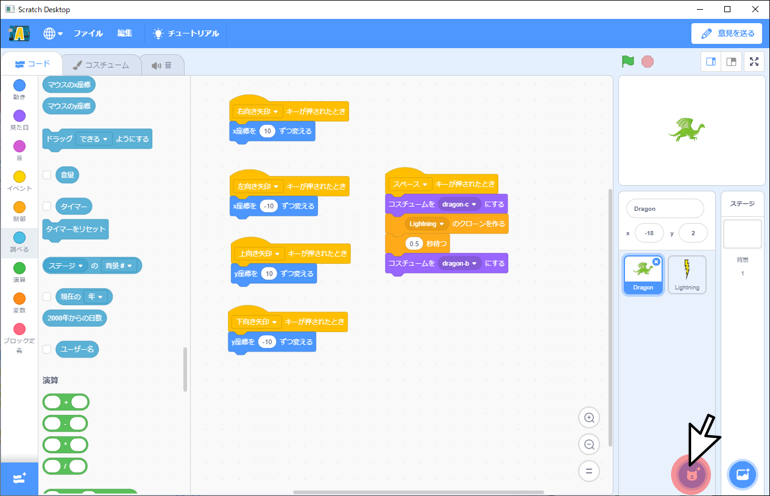

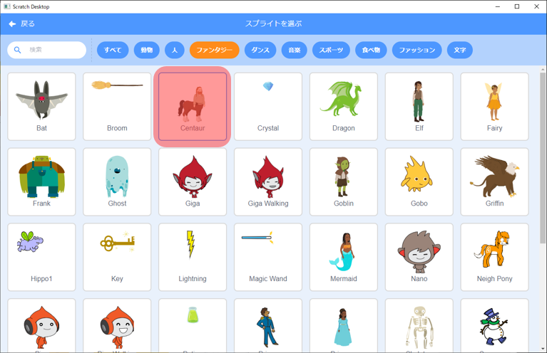

- 大きさを100から40、▶◀をクリックしてから、向きを90°から-90°に変更する。

    Change size 100 to 40. Click ▶◀ and change direction 90° to -90°.

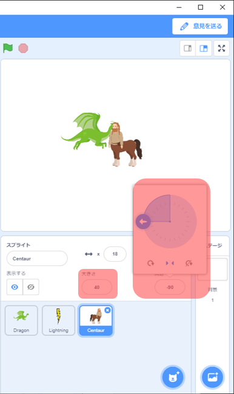

- 以下の図の通り、カテゴリごとのブロックをドラック&ドロップし、ブロック同士をつなげる。

    As shown in the figure below, drag and drop blocks for each category to connect the blocks.

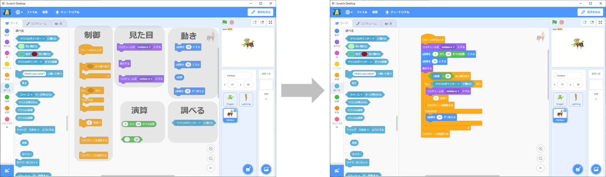

- centaur-aの右側にある▼ボタンを押し、[centaur-a]から[centaur-c]に変更する。

    Press the ▼ button on the right side of "centaur-a" to change the "centaur-a" to "centaur-c".

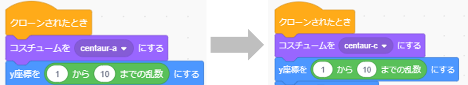

- ブロックの1をダブルクリックし、[1]から[-120]に、10をダブルクリックし、[10]から[120]に変更する。

    Double-clicking on a 1 and change the number 1 to -120. And Double-clicking on a 10 and change the number 10 to 120.

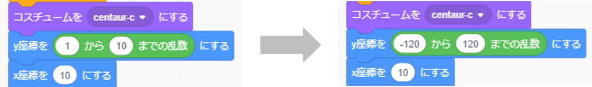

- ブロックの10をダブルクリックし、[10]から[240]に変更する。

    Double-clicking on a 10 and change the number 10 to 240.

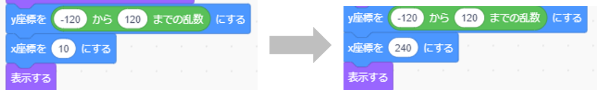

- ブロックの50をクリックし、[50]から[-220]に変更する。

    Double-clicking on a 50 and change the number 50 to -220.

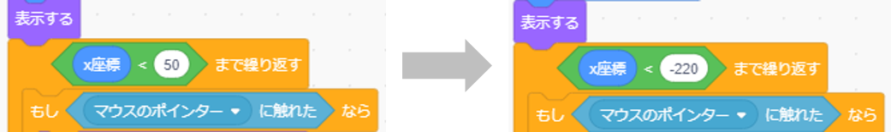

- マウスのポインターの右側にある▼ボタンを押し、[マウスのポインター]から[Lightning]に変更する。

    Press the ▼ button on the right side of "マウスのポインター" to change the "マウスのポインター" to "Lightning".

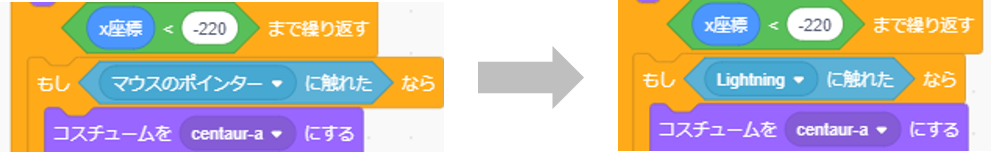

- centaur-aの右側にある▼ボタンを押し、[centaur-a]から[centaur-d]に変更する。

    Press the ▼ button on the right side of "centaur-a" to change the "centaur-a" to "centaur-d".

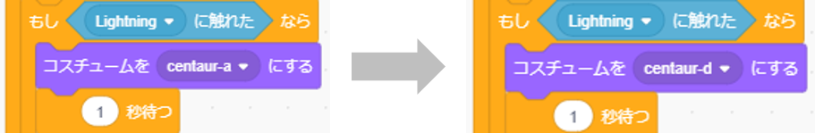

- ブロックの1をダブルクリックし、[1]から[0.5]に変更する。

    Double-clicking on a 1 and change the number 1 to 0.5.

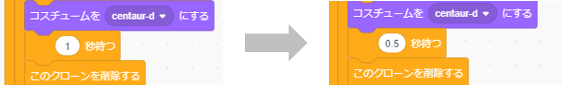

- ブロックの10をダブルクリックし、[10]から[-5]に変更する。

    Double-clicking on a 10 and change the number 10 to -5.

- Centaurを非表示にする。

    Hide Centaur.

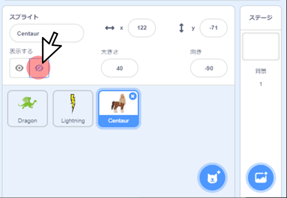

- これでケンタウロスのプログラムは完成です。

    Centaur program is complete.
