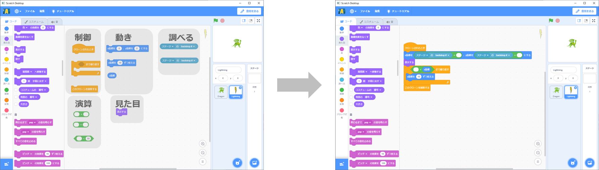
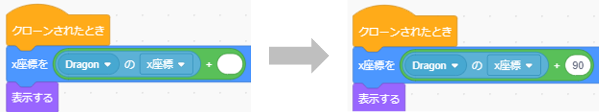
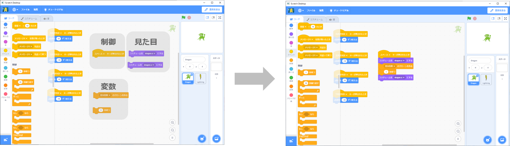

# ドラゴンの作り方(How to make dragon)

## 完成イメージ(Completed image)
- Dragonのスプライト

    Compleate Dragon sprite.

- Lightningのスプライト

    Compleate Lightning sprite.

# プログラムの作り方(How to develop a program)

## ドラゴンの操作設定(How to make dragon operation)
- スプライトを新規に追加する。(スプライト追加ボタン→Dragonをクリック)

    Add new sprite.(Click add splite button → Click Dragon)

- 大きさを100から30に変更する。

    Change size 100 to 30.

- 以下の図の通り、カテゴリごとのブロックをドラック&ドロップし、ブロック同士をつなげる。

    As shown in the figure below, drag and drop blocks for each category to connect the blocks.

- スペースの右側にある▼ボタンを押し、[スペース]から[右向き矢印]に変更する。

    Press the ▼ button on the right side of "スペース" to change the "スペース" to "右向き矢印".

- スペースの右側にある▼ボタンを押し、[スペース]から[左向き矢印]に変更する。

    Press the ▼ button on the right side of "スペース" to change the "スペース" to "左向き矢印".

- ブロックの数字をダブルクリックし、10から-10に変更する。

    Double-clicking on a number and change the number 10 to -10.

- スペースの右側にある▼ボタンを押し、[スペース]から[上向き矢印]に変更する。

    Press the ▼ button on the right side of "スペース" to change the "スペース" to "上向き矢印".

- スペースの右側にある▼ボタンを押し、[スペース]から[下向き矢印]に変更する。

    Press the ▼ button on the right side of "スペース" to change the "スペース" to "下向き矢印".

- ブロックの数字をダブルクリックし、10から-10に変更する。

    Double-clicking on a number and change the number 10 to -10.

## ドラゴンに火を吹かせる(How to make dragon beath)
- スプライトを新規に追加する。(スプライト追加ボタン→Lighntingをクリック)

    Add new sprite.(Click add splite button → Click Lightning)

- 大きさを100から30、向きを90°から180°に変更する。

    Change size 100 to 30. And change direction 90° to 180°.

- 以下の図の通り、カテゴリごとのブロックをドラック&ドロップし、ブロック同士をつなげる。

    As shown in the figure below, drag and drop blocks for each category to connect the blocks.

- ステージの右側にある▼ボタンを押し、[ステージ]から[Dragon]に変更する。右のボタンが[x座標▼]になっていることを確認する。

    Press the ▼ button on the right side of "ステージ" to change the "ステージ" to "Dragon".

    Confirm right button "x座標▼"

- ブロックの白枠をダブルクリックし、90を入力する。

    Double-clicking on a blank and input the number 90.

- ステージの右側にある▼ボタンを押し、[ステージ]から[Dragon]に変更する。

    Press the ▼ button on the right side of "ステージ" to change the "ステージ" to "Dragon".

- x座標の右側にある▼ボタンを押し、[x座標]から[y座標]に変更する。

    Press the ▼ button on the right side of "x座標" to change the "x座標" to "y座標".

- ブロックの白枠をダブルクリックし、5を入力する。

    Double-clicking on a blank and input the number 5.

- ブロックの白枠をダブルクリックし、240を入力する。

    Double-clicking on a blank and input the number 240.

- Lighntingを非表示にする。

    Hide Lightning.

- ドラゴンのスプライトで以下の図の通り、カテゴリごとのブロックをドラック&ドロップし、ブロック同士をつなげる。

    In Dragon sprite. As shown in the figure below, drag and drop blocks for each category to connect the blocks.

- dragon-aの右側にある▼ボタンを押し、[dragon-a]から[dragon-c]に変更する。

    Press the ▼ button on the right side of "dragon-a" to change the "dragon-a" to "dragon-c".

- 自分自身の右側にある▼ボタンを押し、[自分自身]から[Lightning]に変更する。

    Press the ▼ button on the right side of "自分自身" to change the "自分自身" to "Lightning".

- ブロックの1をダブルクリックし、[1]から[0.5]に変更する。

    Double-clicking on a 1 and change the number 1 to 0.5.

- dragon-aの右側にある▼ボタンを押し、[dragon-a]から[dragon-b]に変更する。

    Press the ▼ button on the right side of "dragon-a" to change the "dragon-a" to "dragon-b".

- これでドラゴンのプログラムは完成です。

    Dragon program is complete.
