# ステージの作り方(How to make stage)

## 前提
**[ドラゴンの作り方](make_dragon.md)と[敵の作り方(ケンタウロス)](make_centaur.md)のプログラムが完成** していること。

    Dragon's program and Centaur's program is complete.

## 完成イメージ(Completed image)
- ステージのスプライト

    Compleate stage sprite.

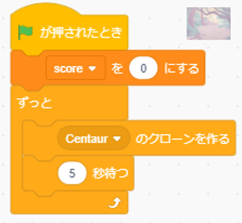

- Centaurのスプライト

    Compleate Centaur sprite.

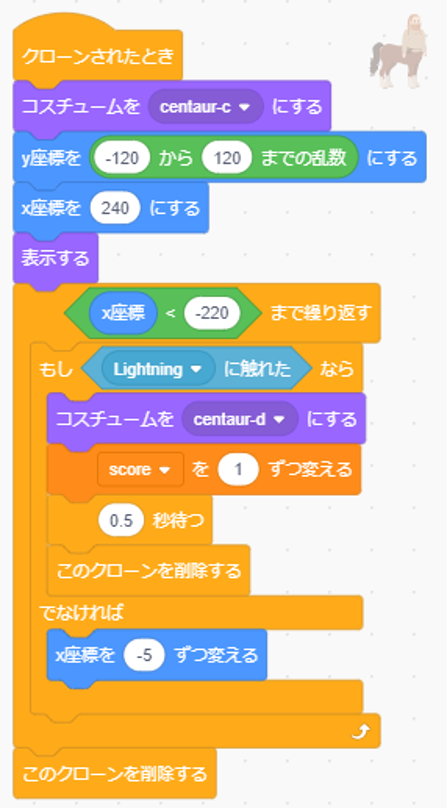

# プログラムの作り方(How to develop a program)
- 背景を追加する。(背景を選ぶボタン→Jungleをクリック)

    Add background.(Click select background button → Click Jungle)

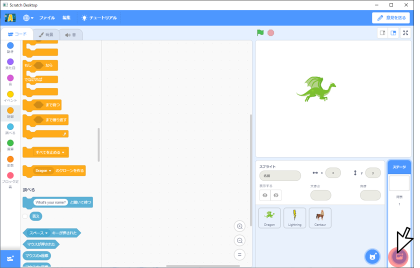

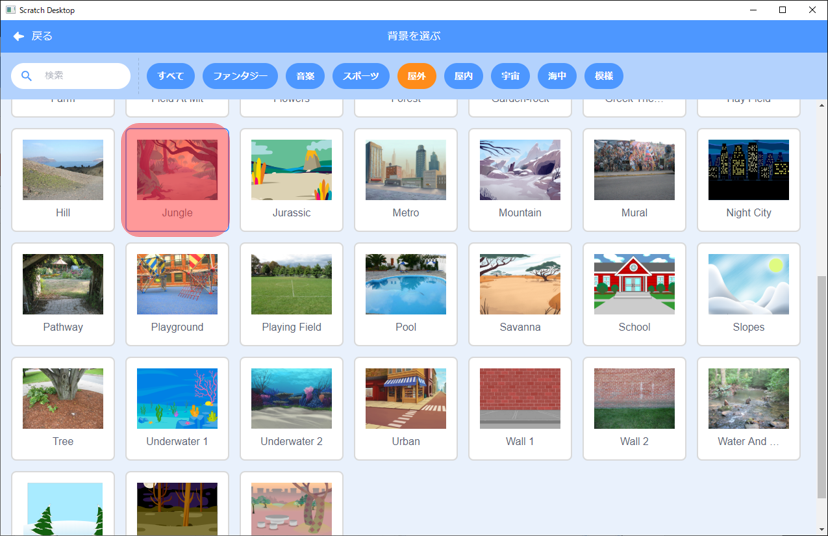

- 変数を追加する。([変数を作る]→[score]変数を作成。)

    Add new variable.("変数を作る" → create variable named "score" )

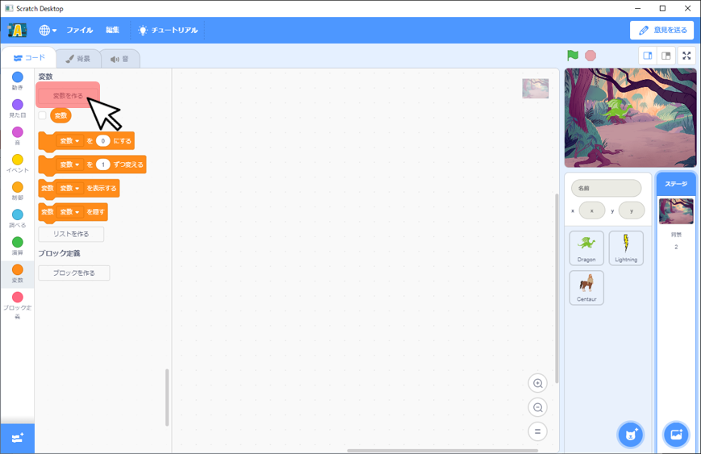

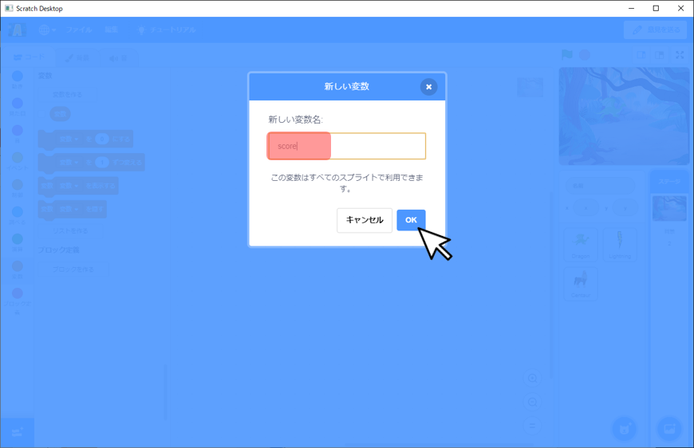

- 以下の図の通り、カテゴリごとのブロックをドラック&ドロップし、ブロック同士をつなげる。

    As shown in the figure below, drag and drop blocks for each category to connect the blocks.

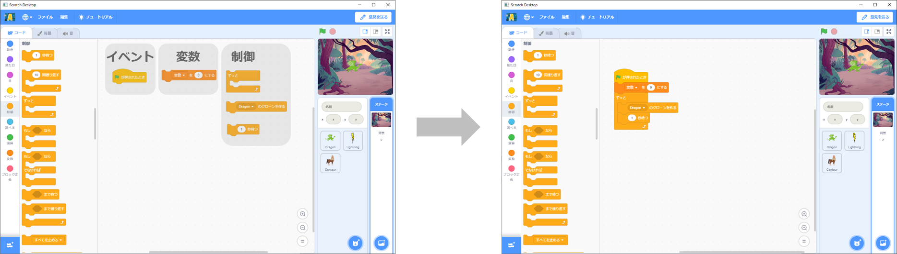

- 変数の右側にある▼ボタンを押し、[変数]から[score]に変更する。

    Press the ▼ button on the right side of "変数" to change the "変数" to "score".

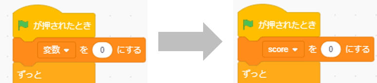

- Dragonの右側にある▼ボタンを押し、[Dragon]から[Centaur]に変更する。

    Press the ▼ button on the right side of "Dragon" to change the "Dragon" to "Centaur".

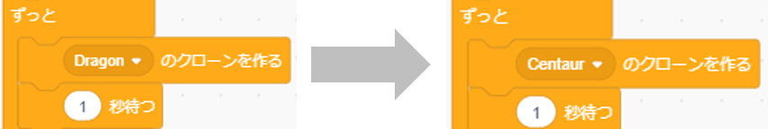

- ブロックの数字をダブルクリックし、[1]から[5]に変更する。

    Double-clicking on a number and change the number 1 to 5.

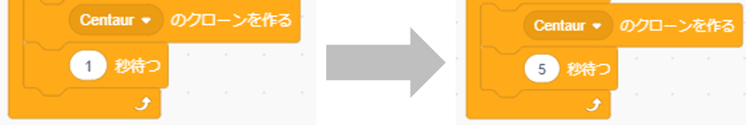

- ケンタウロスのスプライトで以下の図の通り、ブロックをドラック&ドロップし、ブロック同士をつなげる。

    In Centaur sprite. As shown in the figure below, drag and drop blocks for each category to connect the blocks.

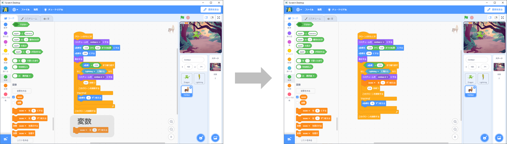

- 追加したブロックが[score▼]を[1]ずつ変えるになっていることを確認する。

    Confirm add block is "[score▼]を[1]ずつ変える".

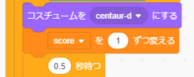

- これでステージのプログラムは完成です。

    Stage program is complete.
